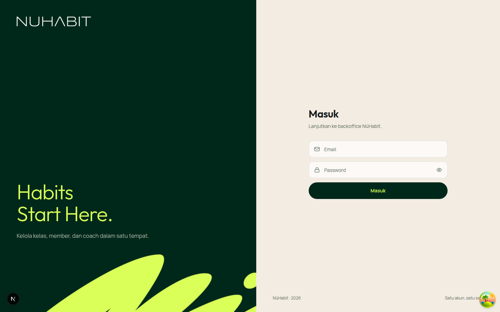
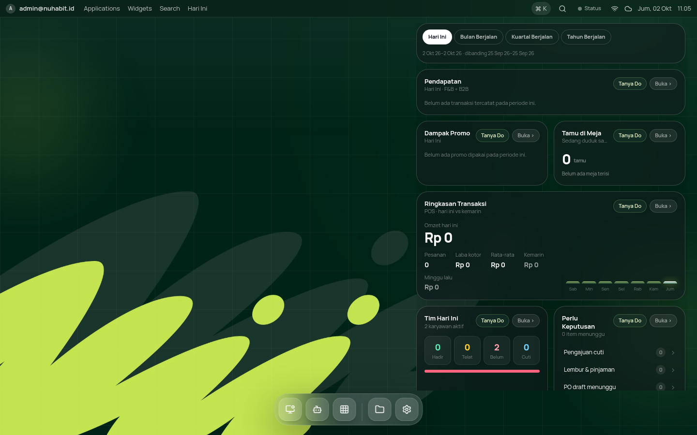
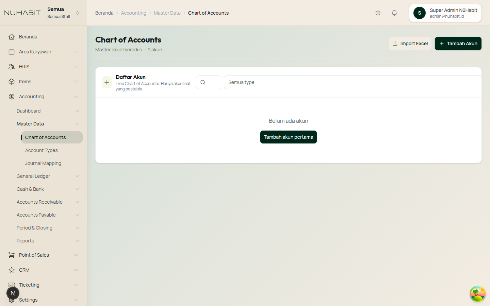

# NüHabit UI Styling Guide — Login · Desktop · Dashboard

> Panduan implementasi untuk tim yang membangun ulang tampilan NüHabit di **project lain**.
> Nilai untuk **login, desktop, sidebar, dan token** diambil langsung dari implementasi yang
> berjalan di **https://nuhabitdev.reddie.id**; ikuti persis. Bagian yang ditandai **(standar)**
> (tabel, badge, KPI tile) adalah aturan dari `DESIGN.md` untuk dipakai konsisten di layar baru.
>
> Contoh kode memakai **Tailwind CSS v4 + React**. Untuk stack lain, pakai nilai CSS
> mentah di setiap tabel (px, hex, rgba).
>
> Dasar brand: *NüHabit Brand Guideline 2026*. Kepribadian brand: **The Quiet Competitor**,
> yaitu tenang, presisi, dan percaya diri tanpa berteriak. Ruang lega, ornamen seperlunya.

| Login | Desktop | Dashboard |
|---|---|---|
|  |  |  |

---

## Daftar Isi

1. [Setup: Token, Font, Aset](#1-setup-token-font-aset)
2. [Halaman Login](#2-halaman-login)
3. [Desktop (Launcher / OS)](#3-desktop-launcher--os)
4. [Dashboard (Backoffice)](#4-dashboard-backoffice)
5. [Komponen Dasar](#5-komponen-dasar)
6. [Dark Mode](#6-dark-mode)
7. [Copy & Microcopy](#7-copy--microcopy)
8. [Checklist QA](#8-checklist-qa)

---

## 1. Setup: Token, Font, Aset

### 1.1 Palet warna

| Token | Hex | Peran |
|---|---|---|
| `nh-beige` | `#f3ece2` | **White Beige**: kanvas utama (light) |
| `nh-forest` | `#00281a` | **Deep Forest Green**: warna utama, tombol primer, item aktif |
| `nh-lime` | `#daff59` | **Pale Lime**: aksen energi, teks aktif di atas forest, CTA di atas gelap |
| `nh-jungle` | `#1c261b` | Kartu di dark mode |
| `nh-everglade` | `#203b32` | Secondary, hover tombol forest, surface gelap |
| `nh-lettuce` | `#abde67` | Aksen segar, status positif, chart |
| `nh-lemon` | `#eeffb1` | Latar highlight lembut |
| `nh-mint` | `#fdfff2` | Netral terang alternatif |
| `nh-ochre` | `#c9a227` | Sorotan hangat (premium, warning lembut) |
| `nh-ink` | `#131a1c` | Teks utama (light), kanvas dark & desktop |

**Proporsi:** sekitar 60% beige/netral, 30% forest/ink, 10% lime. Lime adalah bumbu;
**jangan** jadikan latar area besar di light mode, dan **jangan** pakai lime/lettuce/lemon
sebagai warna teks di atas latar terang (kontras < 2:1).

### 1.2 Token semantik (light mode)

| Variabel | Nilai | Keterangan |
|---|---|---|
| `--background` | `#f3ece2` | Kanvas halaman |
| `--foreground` | `#131a1c` | Teks utama |
| `--card` | `#fffdf9` | Permukaan kartu/popover |
| `--primary` | `#00281a` | Tombol primer |
| `--primary-foreground` | `#f3ece2` | Teks di atas primer |
| `--secondary` / `--muted` | `#ebe3d6` | Surface sekunder |
| `--muted-foreground` | `#5b6b60` | Teks sekunder (kontras 4.82:1 di atas beige) |
| `--accent` | `#eeffb1` | Highlight lembut |
| `--accent-foreground` | `#00281a` | |
| `--border` | `#e2d8c8` | Garis kartu/pemisah |
| `--input` | `#d6cab6` | Border field |
| `--ring` | `#4e8a6e` | Focus ring (3.45:1 di atas beige) |
| `--destructive` | `#c2410c` | Error / hapus |
| `--radius` | `0.75rem` (12px) | Radius dasar |
| `--sidebar-background` | `#ebe3d6` | |
| `--sidebar-foreground` | `#131a1c` | |
| `--sidebar-active-background` | `#00281a` | |
| `--sidebar-active-foreground` | `#daff59` | |
| `--sidebar-border` | `#ddd2c0` | |
| `--navbar-background` | `#f3ece2` | |
| `--navbar-border` | `#e2d8c8` | |

### 1.3 CSS siap tempel (Tailwind v4)

```css
/* globals.css */
@import "tailwindcss";

@theme {
  --color-nh-beige: #f3ece2;
  --color-nh-forest: #00281a;
  --color-nh-lime: #daff59;
  --color-nh-jungle: #1c261b;
  --color-nh-everglade: #203b32;
  --color-nh-lettuce: #abde67;
  --color-nh-lemon: #eeffb1;
  --color-nh-mint: #fdfff2;
  --color-nh-ochre: #c9a227;
  --color-nh-ink: #131a1c;

  --font-display: var(--font-outfit), Outfit, Manrope, system-ui, sans-serif;
}

@theme inline {
  --color-background: var(--background);
  --color-foreground: var(--foreground);
  --color-card: var(--card);
  --color-primary: var(--primary);
  --color-primary-foreground: var(--primary-foreground);
  --color-secondary: var(--secondary);
  --color-muted: var(--muted);
  --color-muted-foreground: var(--muted-foreground);
  --color-accent: var(--accent);
  --color-accent-foreground: var(--accent-foreground);
  --color-border: var(--border);
  --color-input: var(--input);
  --color-ring: var(--ring);
  --color-destructive: var(--destructive);
  --font-sans: var(--font-manrope), Manrope, Inter, system-ui, sans-serif;
}

:root {
  --background: #f3ece2;
  --foreground: #131a1c;
  --card: #fffdf9;
  --primary: #00281a;
  --primary-foreground: #f3ece2;
  --secondary: #ebe3d6;
  --muted: #ebe3d6;
  --muted-foreground: #5b6b60;
  --accent: #eeffb1;
  --accent-foreground: #00281a;
  --border: #e2d8c8;
  --input: #d6cab6;
  --ring: #4e8a6e;
  --destructive: #c2410c;
  --radius: 0.75rem;

  --sidebar-background: #ebe3d6;
  --sidebar-foreground: #131a1c;
  --sidebar-active-background: #00281a;
  --sidebar-active-foreground: #daff59;
  --sidebar-border: #ddd2c0;
  --navbar-background: #f3ece2;
  --navbar-border: #e2d8c8;

  /* Latar area konten dashboard */
  --page-mesh: linear-gradient(135deg, color-mix(in oklch, #00281a 8%, #f3ece2) 0%, #f3ece2 100%);
}

body { background: var(--background); color: var(--foreground); font-family: var(--font-sans); }

@layer base {
  h1, h2, h3 { font-family: var(--font-display); letter-spacing: -0.01em; }
}
```

> **Tailwind v3?** Masukkan warna `nh-*` ke `theme.extend.colors` dan font ke
> `theme.extend.fontFamily` di `tailwind.config.js`; variabel `:root` tetap sama.

### 1.4 Font

| Peran | Font | Bobot | Catatan |
|---|---|---|---|
| Judul / display | **Outfit** | 300 untuk hero besar, 500–600 untuk heading UI | Geometric sans |
| Isi / UI | **Manrope** | 400 · 500 · 600 · 700 | Semua teks isi, tabel, form |

**Self-host** variable font (lisensi OFL), jangan bergantung pada Google Fonts saat build.
Di project ini, build Docker gagal ketika memakai `next/font/google`. File yang dipakai
(subset latin, sudah mencakup "ü"):

- `manrope-latin-variable.woff2` (weight 200–800)
- `outfit-latin-variable.woff2` (weight 100–900)

Contoh Next.js:

```tsx
import localFont from "next/font/local";

const manrope = localFont({ src: "./fonts/manrope-latin-variable.woff2", weight: "200 800", variable: "--font-manrope", display: "swap" });
const outfit  = localFont({ src: "./fonts/outfit-latin-variable.woff2",  weight: "100 900", variable: "--font-outfit",  display: "swap" });

<html lang="id" className={`${manrope.variable} ${outfit.variable}`}>
```

Stack lain: `@font-face { font-family: Manrope; src: url(manrope-latin-variable.woff2) format("woff2"); font-weight: 200 800; font-display: swap; }`.

### 1.5 Aset (salin dari repo Nuhabit `public/brand/`)

| File | Pakai untuk |
|---|---|
| `logo-white.png` / `logo-neon.png` | Logo **NUHABIT** untuk latar gelap (1325×173, rasio 7.66:1, transparan) |
| `logo-forest.png` / `logo-ink.png` | Logo untuk latar terang |
| `nuhabit-logo-white.png` / `nuhabit-logo-neon.png` | Master dari owner (dengan margin), jangan diubah |
| `nuhabit-icon-512.png`, `nuhabit-icon-180.png`, `favicon.ico/svg` | App icon, favicon, sidebar collapsed (sapuan "Nü" lime di atas forest, rounded) |
| `nuhabit-mark-lime.png` | Sapuan "Nü" untuk grafis dekoratif saja, **bukan logo**. Boleh dikombinasikan dengan logo NUHABIT di satu layar; logo utama tetap NUHABIT |
| `wallpaper-forest.webp` | Wallpaper desktop default (2560×1440) |
| `wallpaper-ink.webp` | Wallpaper alternatif "Lime Strokes" |
| `wallpaper-pattern.webp` | Wallpaper alternatif "Nü Pattern" |
| `/favicon.svg` | Favicon |
| `src/app/fonts/*.woff2` | Font (lihat 1.4) |

**Aturan logo:** jangan di-stack, diputar, diberi drop shadow, diregangkan, atau diganti font.
Tinggi minimum 14px (garisnya tipis). Ruang kosong minimal setinggi huruf di semua sisi.
Putih/neon hanya di atas latar gelap; forest/ink di atas latar terang.

---

## 2. Halaman Login


### 2.1 Struktur

```
┌──────────────────────────────┬──────────────────────────────┐
│ PANEL MEREK (bg forest)      │ PANEL FORM (bg beige)        │
│  logo NUHABIT putih, h-28px  │                              │
│                              │      Masuk  (H1 Outfit 30px) │
│                              │      subjudul muted 14px     │
│  "Habits                     │      [ Email           ]     │
│   Start Here."  lime 60px    │      [ Password     👁  ]     │
│  sub beige/75 16px           │      ( Masuk — pill )        │
│     ░░ sapuan "Nü" lime ░░   │                              │
│  ░░░░ terpotong kanan-bawah  │  NüHabit · 2026   Satu akun… │
└──────────────────────────────┴──────────────────────────────┘
   lg: grid 1.05fr / 1fr            mobile: panel merek disembunyikan
```

### 2.2 Spesifikasi

| Elemen | Nilai |
|---|---|
| Layout | `grid min-h-dvh`, `lg:grid-cols-[1.05fr_1fr]` |
| Panel merek | `bg #00281a`, padding 48px, flex column `justify-between`, `overflow-hidden`, **hanya ≥1024px** |
| Logo | `logo-white.png`, tinggi 28px |
| Tagline | "Habits / Start Here.", Outfit **300**, 60px, line-height 1.05, `tracking-tight`, warna `#daff59` |
| Sub-tagline | Manrope 16px, `#f3ece2` 75% opacity, margin-top 20px |
| Grafis | `nuhabit-mark-lime.png`, `absolute`, `-bottom-36 -right-40` (−144px / −160px), lebar 120% panel, `max-w-none`, dekoratif (`aria-hidden`) |
| Panel form | bg `#f3ece2`, padding 32px vertikal / 24px (48px ≥640px) |
| Logo mobile | `logo-forest.png` tinggi 24px, hanya `<1024px` |
| Kontainer form | `max-width: 400px`, center vertikal |
| H1 "Masuk" | Outfit 600, 30px |
| Subjudul | 14px, `--muted-foreground`, margin-top 8px |
| Field | tinggi 48px, radius 12px, border `--input`, bg `--card`, padding-left 44px (ikon 16px di left 16px), teks 14px |
| Field focus | border `--ring` + `ring-4` `--ring` 20% |
| Tombol submit | tinggi 48px, **pill** (`rounded-full`), bg `#00281a`, teks `#daff59` 14px semibold; hover bg `#203b32`; disabled opacity 60% |
| Error | radius 12px, border destructive 30%, bg destructive 10%, teks destructive 14px, `role="alert"` |
| Footer | 12px muted, `justify-between` |
| Transisi sukses | fade + `scale(1.01)` 500ms sebelum redirect |

### 2.3 Kode referensi

```tsx
const inputClass =
  "h-12 w-full rounded-xl border border-input bg-card pl-11 text-sm text-foreground outline-none transition placeholder:text-muted-foreground focus:border-ring focus:ring-4 focus:ring-ring/20";

<main className="relative grid min-h-dvh bg-background text-foreground lg:grid-cols-[1.05fr_1fr]">
  <aside className="relative hidden overflow-hidden bg-nh-forest text-nh-beige lg:flex lg:flex-col lg:justify-between lg:p-12">
    
    
    <div className="relative max-w-md pb-40">
      <p className="font-display text-6xl font-light leading-[1.05] tracking-tight text-nh-lime">
        Habits<br />Start Here.
      </p>
      <p className="mt-5 text-base text-nh-beige/75">Kelola kelas, member, dan coach dalam satu tempat.</p>
    </div>
  </aside>

  <section className="flex min-h-dvh flex-col px-6 py-8 sm:px-12">
    
    <div className="mx-auto flex w-full max-w-[400px] flex-1 flex-col justify-center py-10">
      <h1 className="text-3xl font-semibold">Masuk</h1>
      <p className="mt-2 text-sm text-muted-foreground">Lanjutkan ke backoffice NüHabit.</p>
      <form className="mt-8 space-y-3">
        <label className="relative block">
          <span className="sr-only">Email</span>
          <MailIcon className="pointer-events-none absolute left-4 top-1/2 size-4 -translate-y-1/2 text-muted-foreground" />
          <input type="email" className={`${inputClass} pr-4`} placeholder="Email" autoComplete="email" required />
        </label>
        <label className="relative block">
          <span className="sr-only">Password</span>
          <LockIcon className="pointer-events-none absolute left-4 top-1/2 size-4 -translate-y-1/2 text-muted-foreground" />
          <input type="password" className={`${inputClass} pr-12`} placeholder="Password" autoComplete="current-password" required />
          {/* tombol tampilkan password: absolute right-4, ikon 16px muted, aria-label wajib */}
        </label>
        <button type="submit"
          className="h-12 w-full rounded-full bg-nh-forest text-sm font-semibold text-nh-lime transition hover:bg-nh-everglade disabled:opacity-60">
          Masuk
        </button>
      </form>
    </div>
    <div className="flex items-center justify-between text-xs text-muted-foreground">
      <span>NüHabit · 2026</span><span>Satu akun, satu sesi</span>
    </div>
  </section>
</main>
```

---

## 3. Desktop (Launcher / OS)


Desktop adalah halaman pertama setelah login untuk owner/super admin: wallpaper penuh,
top bar tipis, kolom widget KPI di kanan, dan dock aplikasi di bawah. Semua permukaan
memakai **glass gelap** di atas wallpaper.

### 3.1 Lapisan latar (urutan dari bawah)

| # | Lapisan | Kelas / nilai |
|---|---|---|
| 0 | Root | `relative min-h-dvh overflow-hidden bg-nh-ink text-white` |
| 1 | Wallpaper | `absolute inset-0 bg-cover bg-center`, `background-image: url(/brand/wallpaper-forest.webp)` |
| 2 | Penggelap | `absolute inset-0 bg-black/10` |
| 3 | Grid halus | `opacity: .06`, garis putih 1px tiap **80px** (lihat kode) |
| 4 | Glow kiri-atas | `-left-24 top-24 size-72 rounded-full bg-nh-lime/10 blur-3xl` |
| 5 | Glow kanan-bawah | `-right-24 bottom-16 size-80 rounded-full bg-nh-lettuce/10 blur-3xl` |
| 6 | Kilau atas | `inset-x-0 top-0 h-72 bg-gradient-to-b from-white/5 to-transparent` |

```tsx
<div className="relative min-h-dvh overflow-hidden bg-nh-ink text-white">
  <div className="absolute inset-0 bg-cover bg-center bg-no-repeat"
       style={{ backgroundImage: "url('/brand/wallpaper-forest.webp')" }} />
  <div className="absolute inset-0 bg-black/10" />
  <div className="absolute inset-0 opacity-[0.06] [background-image:linear-gradient(rgba(255,255,255,.7)_1px,transparent_1px),linear-gradient(90deg,rgba(255,255,255,.7)_1px,transparent_1px)] [background-size:80px_80px]" />
  <div className="pointer-events-none absolute -left-24 top-24 size-72 rounded-full bg-nh-lime/10 blur-3xl" />
  <div className="pointer-events-none absolute -right-24 bottom-16 size-80 rounded-full bg-nh-lettuce/10 blur-3xl" />
  <div className="absolute inset-x-0 top-0 h-72 bg-gradient-to-b from-white/5 to-transparent" />
  {/* top bar, konten, dock */}
</div>
```

**Wallpaper:** sapuan lime **hanya di ~55% kiri** layar, karena kolom widget ada di kanan dan
teks putih di atas lime tidak terbaca. Kalau membuat wallpaper baru, jaga sisi kanan tetap gelap.

| Wallpaper | File | Karakter |
|---|---|---|
| NüHabit Forest (default) | `wallpaper-forest.webp` | Forest + sapuan "Nü" lime besar kiri-bawah, gema everglade |
| Lime Strokes | `wallpaper-ink.webp` | Ink + outline "Nü" lime |
| Nü Pattern | `wallpaper-pattern.webp` | Forest + mark everglade berulang |
| Everglade | CSS `linear-gradient(135deg,#131a1c,#00281a 52%,#203b32)` | Gradasi polos |

### 3.2 Top bar

| Properti | Nilai |
|---|---|
| Posisi | `fixed inset-x-0 top-0 z-[75]` |
| Tinggi | **36px** (`h-9`) |
| Latar | `bg-black/22` + `backdrop-blur-2xl`, border bawah `white/10` |
| Teks | 13px, `white/90`; menu kiri `white/72`, gap 20px |
| Kiri | avatar 20px (`rounded-md bg-white/15`, inisial 10px uppercase) + email semibold · Applications · Widgets · Search · Hari Ini |
| Kanan | chip ⌘K (`rounded-full bg-white/10 px-2 py-1`), ikon 16px (search, wifi, cloud), tanggal + jam |

### 3.3 Area konten

`relative z-10 min-h-dvh px-6 pt-14 pb-28`. Kolom widget menempel di kanan (± 560px),
kartu disusun grid 2 kolom dengan gap 12–16px; kartu "wide" mengambil 2 kolom.

### 3.4 Kartu widget

```ts
const CARD = "rounded-3xl border border-white/18 bg-nh-ink/55 shadow-2xl backdrop-blur-2xl";
```

| Elemen | Nilai |
|---|---|
| Permukaan | radius **24px**, border `white/18`, bg `#131a1c` 55%, `shadow-2xl`, `backdrop-blur-2xl`, padding 16px |
| Judul | 13px bold, `leading-tight`, putih |
| Subjudul | 11px, `white/40`, truncate |
| Chip "Tanya Do" (aksi AI) | `rounded-full border border-nh-lettuce/35 bg-nh-lettuce/15 px-2.5 py-1 text-[11px] font-semibold text-nh-lemon hover:bg-nh-lettuce/25` (di repo Nuhabit tertulis `pink-400/35 · pink-500/15 · text-pink-100`, skala `pink-*` di sana = hijau NüHabit) |
| Chip "Buka ›" | `rounded-full border border-white/14 bg-white/8 px-2.5 py-1 text-[11px] font-semibold text-white/55 hover:bg-white/16 hover:text-white` |
| Angka KPI | Outfit/Manrope 700, 28–32px, putih, `tabular-nums` |
| Label kecil | 11px `white/40` |
| Naik / turun | `text-emerald-300` / `text-rose-300` (semantik, jangan diganti warna brand) |
| Empty state | 12px `white/45`, contoh: "Belum ada transaksi tercatat pada periode ini." |
| Bar chart mini | batang `rounded-t-md`, hari ini: gradien `from-nh-lettuce to-white` + glow `0 0 14px rgba(218,255,89,.45)` |

**Segmented periode** (kartu teratas): pill `rounded-full px-3 py-1.5 text-[11px] font-bold`;
aktif `bg-white text-nh-ink`; non-aktif `border border-white/18 text-white/70 hover:text-white`; `aria-pressed`.

### 3.5 Dock

| Properti | Nilai |
|---|---|
| Kontainer | `fixed bottom-5 left-1/2 -translate-x-1/2 z-[75]`, radius **28px**, border `white/18`, bg `white/14`, padding 8px, gap 8px, `backdrop-blur-2xl`, shadow `0 24px 80px rgba(0,0,0,.38)` |
| Tombol | **48×48px**, radius 16px, border `white/14`, bg `white/14`, ikon 20px putih, `shadow-lg` |
| Hover | `-translate-y-3 scale-125 bg-white/24` (efek magnifikasi ala macOS), 200ms |
| Aktif | bg `white/24` + `ring-1 ring-nh-lettuce/50` + titik 6px di bawah (`bg-nh-lemon`, glow lime) |
| Berjalan (jendela terbuka) | titik 6px `white/70` |
| Pemisah grup | garis vertikal 1px `white/15`, tinggi 32px |
| Mobile | tombol 40px radius 12px, dock radius 24px, `bottom-3`, scroll horizontal |

```tsx
<nav className="fixed bottom-3 left-1/2 z-[75] flex max-w-[calc(100vw-12px)] -translate-x-1/2 items-end gap-1 overflow-x-auto rounded-3xl border border-white/18 bg-white/14 p-1.5 shadow-[0_24px_80px_rgba(0,0,0,.38)] backdrop-blur-2xl sm:bottom-5 sm:gap-2 sm:rounded-[28px] sm:p-2">
  <button className={`group relative grid size-10 place-items-center rounded-xl border border-white/14 text-white shadow-lg transition duration-200 hover:-translate-y-3 hover:scale-125 hover:bg-white/24 sm:size-12 sm:rounded-2xl ${active ? "bg-white/24 ring-1 ring-nh-lettuce/50" : "bg-white/14"}`}>
    <Icon className="size-4 transition group-hover:scale-110 sm:size-5" />
    {active && <span className="absolute -bottom-1 size-1.5 rounded-full bg-nh-lemon shadow-[0_0_12px_rgba(218,255,89,.9)]" />}
  </button>
</nav>
```

### 3.6 Jendela & ikon aplikasi

- **Jendela** (modul dibuka di desktop): permukaan sama dengan `CARD` (radius 24px, ink 55%, blur), title bar 40px.
- **Ikon aplikasi** (grid Applications): kotak 64px radius 24px, gradien
  `bg-gradient-to-br from-pink-400 via-pink-500 to-pink-700`. Di palet NüHabit setara dengan
  `#7fb06a → #3f7a5f → #00281a`, ikon putih. Label 12px putih di bawah.

---

## 4. Dashboard (Backoffice)


### 4.1 Kerangka

```
┌────────────┬───────────────────────────────────────────────────────┐
│ LOGO  Scope│ Breadcrumb                         ☀  🔔  [user chip] │ 76px
├────────────┼───────────────────────────────────────────────────────┤
│ ⌂ Beranda  │  H1 Judul Halaman                [Outline] [Primary] │
│ ▸ HRIS     │  subjudul                                             │
│ ▾ Accounting│ ───────────────────────────────────────────────────── │
│   Master ▾ │  ┌ Card ───────────────────────────────────────────┐  │
│  ▌Chart…   │  │                                                 │  │
│   Types    │  └─────────────────────────────────────────────────┘  │
│ 256px      │  content padding 24px, bg = --page-mesh              │
└────────────┴───────────────────────────────────────────────────────┘
```

### 4.2 Sidebar

| Properti | Nilai |
|---|---|
| Lebar | **256px** (`w-64`); collapsed **80px** (`w-20`) |
| Latar / border | `#ebe3d6`, border kanan 1px `#ddd2c0` |
| Header sidebar | tinggi **76px** (`lg:h-[4.75rem]`) sejajar navbar, border bawah `#ddd2c0`, padding 12px |
| Logo expanded | `logo-forest.png`, tinggi **14px**, max-width 112px; di sebelahnya 2 baris scope (perusahaan 14px semibold, cabang 12px muted) + chevron |
| Logo collapsed | `nuhabit-icon-180.png` 36×36px, radius 8px |
| Item level-1 | `flex items-center gap-3 rounded-lg px-3 py-2.5 text-sm`, ikon 20px |
| Item level-1 aktif | **bg `#00281a`, teks `#daff59`, font-semibold, `shadow-sm`** |
| Hover | bg forest 10% (`color-mix(in srgb, #00281a 10%, transparent)`), teks forest |
| Grup (punya anak) | chevron 16px di kanan, rotasi 180° saat terbuka; saat aktif hanya teks forest semibold (tanpa bg) |
| Sub-item | `relative rounded-md py-2 pl-3 pr-2 text-sm`, indent 24px, garis panduan kiri 1px `#ddd2c0` |
| Sub-item aktif | bg forest 12%, teks forest medium, **bar kiri 3×16px** forest `rounded-r-full` |
| Sub-item normal | teks foreground 70%, hover bg forest 8% |

```tsx
const item = (active: boolean) =>
  `flex w-full items-center gap-3 rounded-lg px-3 py-2.5 text-sm transition-colors ${
    active
      ? "bg-[var(--sidebar-active-background)] font-semibold text-[var(--sidebar-active-foreground)] shadow-sm"
      : "text-[var(--sidebar-foreground)]/90 hover:bg-[color-mix(in_srgb,var(--sidebar-active-background)_10%,transparent)] hover:text-[var(--sidebar-active-background)]"
  }`;

const subItem = (active: boolean) =>
  `relative flex w-full items-center rounded-md py-2 pl-3 pr-2 text-sm transition-colors ${
    active
      ? "bg-[color-mix(in_srgb,var(--sidebar-active-background)_12%,transparent)] font-medium text-[var(--sidebar-active-background)] before:absolute before:left-0 before:top-1/2 before:h-4 before:w-[3px] before:-translate-y-1/2 before:rounded-r-full before:bg-[var(--sidebar-active-background)]"
      : "text-[var(--sidebar-foreground)]/70 hover:bg-[color-mix(in_srgb,var(--sidebar-active-background)_8%,transparent)] hover:text-[var(--sidebar-active-background)]"
  }`;
```

### 4.3 Navbar (header konten)

| Properti | Nilai |
|---|---|
| Tinggi | 76px desktop (64px mobile) |
| Latar | `#f3ece2`, border bawah 1px `#e2d8c8` |
| Breadcrumb | 14px; induk `--muted-foreground`, pemisah chevron 12px, halaman aktif `--foreground` medium |
| Ikon kanan | tombol 36px `rounded-lg`, ikon 20px (toggle tema, notifikasi + badge) |
| User chip | `rounded-xl border border-border bg-card px-3 py-2 shadow-sm`; avatar 36px bulat bg forest teks beige; nama 14px medium + email 12px muted |

### 4.4 Area konten & page header

| Elemen | Nilai |
|---|---|
| Latar konten | `background: var(--page-mesh)` (gradien forest 8% ke beige) |
| Padding | 24px (`p-6`), 16px mobile |
| H1 | Outfit 600, **24–28px**, `--foreground` |
| Subjudul | 14px `--muted-foreground`, margin-top 4px |
| Aksi | kanan atas, gap 8px: tombol outline/secondary lalu **primary** paling kanan |
| Pemisah | border-bottom 1px `--border` di bawah header, margin-bottom 24px |

### 4.5 Kartu konten

| Properti | Nilai |
|---|---|
| Permukaan | bg `#fffdf9`, border 1px `#e2d8c8`, radius **12px**, `shadow-sm` (tanpa bayangan berat) |
| Header kartu | padding 16–20px; ikon/aksi 32px bulat bg lemon lembut; judul Outfit 16px semibold; deskripsi 12px muted |
| Isi | padding 20px |
| Empty state | tengah, teks 14–16px muted + tombol primary kecil ("Tambah akun pertama") |
| Kartu highlight | bg forest, teks beige, angka/aksen lime (paket aktif, sesi berikutnya, KPI utama) |

### 4.6 KPI / stat tile (standar)

```
┌──────────────────────┐   radius 12px, bg card, border, padding 16px
│ (ikon 36px bulat)    │   ikon: bg lemon/lettuce 20%, ikon forest 18px
│ 128                  │   angka: Outfit 600, 28px, tabular-nums
│ Member aktif         │   label: 13px muted
│ ▲ 12% vs bln lalu    │   delta: 12px, hijau (#1e5640) / destructive
└──────────────────────┘
```

---

## 5. Komponen Dasar

### Tombol

| Varian | Kelas | Pemakaian |
|---|---|---|
| Primary | `bg-primary text-primary-foreground hover:bg-primary/85` (forest + beige) | Satu aksi utama per area |
| Accent CTA | `rounded-full bg-nh-lime text-nh-forest font-semibold` | CTA di atas latar gelap / member app |
| Forest pill | `rounded-full bg-nh-forest text-nh-lime hover:bg-nh-everglade` | Login, CTA besar di atas beige |
| Outline | `border border-primary/30 bg-background text-primary hover:bg-primary/5` | Aksi sekunder (Import Excel) |
| Ghost | `hover:bg-muted` | Ikon toolbar |
| Destructive | `bg-destructive/10 text-destructive hover:bg-destructive/20` | Hapus |

Ukuran: **sm** 28px · **default** 32px · **lg** 36px, radius 8px (`rounded-lg`), teks 14px medium,
ikon 16px dengan gap 6px. Di backoffice pakai `rounded-lg`; **pill** khusus login & member app.
Focus: `ring-3 ring-ring/50`.

### Input / Select

`h-9 rounded-lg border border-input bg-card px-3 text-sm placeholder:text-muted-foreground
focus-visible:border-ring focus-visible:ring-3 focus-visible:ring-ring/20`.
Label di atas field: 13px semibold, margin-bottom 6px. Pesan error 12px destructive di bawah field.

### Tabel (standar)

| Elemen | Nilai |
|---|---|
| Header | bg `#ebe3d6` 60%, teks 12px semibold uppercase `tracking-wide` muted, tinggi 40px |
| Baris | tinggi 48px, teks 14px, border-bottom `--border`, hover bg lemon 40% |
| Angka | rata kanan, `tabular-nums` |
| Aksi baris | ikon ghost 32px di kolom terakhir |

### Badge status (standar)

| Status | Kelas |
|---|---|
| Aktif / hadir / lunas | `bg-nh-lettuce/25 text-[#1e5640]` |
| Menunggu / hampir habis | `bg-nh-ochre/20 text-[#7a5f0f]` |
| Expired / batal / gagal | `bg-destructive/10 text-destructive` |
| Draft / netral | `bg-muted text-muted-foreground` |

Bentuk: `rounded-full px-2.5 py-0.5 text-xs font-semibold`.

### Data visualization

Urutan seri: `#1e5640` → `#abde67` → `#c9a227` → `#4e8a6e` → `#daff59` (beri outline forest di atas
beige) → `#131a1c`. Skala sekuensial: `#f4f8e4 → #e9f4c6 → #d3e9a0 → #b2d67a → #7fb06a → #3f7a5f → #1e5640 → #00281a`.

---

## 6. Dark Mode

| Token | Nilai |
|---|---|
| `--background` | `#131a1c` |
| `--card` / popover | `#1c261b` |
| `--secondary` / `--muted` | `#203b32` |
| `--foreground` | `#f3ece2` |
| `--muted-foreground` | `#a9b5a7` |
| `--accent-foreground` | `#daff59` |
| `--border` | `rgba(171,222,103,.16)` |
| `--input` | `rgba(171,222,103,.24)` |
| Primary action | lime `#daff59` + teks forest |
| `--page-mesh` | `linear-gradient(135deg,#131a1c 0%,#1c261b 60%,#00281a 100%)` |

Aktifkan lewat atribut `data-theme="dark"` di `<html>` (plus `auto` mengikuti OS). Teks
aksen forest **wajib** diganti lime/lettuce di dark mode (`dark:text-nh-lime`).
Desktop selalu gelap (tidak ikut mode).

---

## 7. Copy & Microcopy

Tone: tenang, ringkas, hangat, menghormati. Mulai dengan kata kerja. Tanpa hype, tanpa
ALL CAPS di kalimat, tanpa tanda seru berlebihan.

| ✅ Pakai | ❌ Hindari |
|---|---|
| "Masuk", "Lanjutkan ke backoffice NüHabit." | "LOGIN SEKARANG!!!" |
| "Belum ada akun." + tombol "Tambah akun pertama" | "Data kosong" |
| "Sesi kamu sudah terkunci. Sampai jumpa Sabtu, 06.30." | "Booking berhasil!!!" |
| "Tinggal 1 sesi lagi. Lanjutkan kebiasaanmu?" | "Paket hampir habis, segera beli!" |
| latihan · sesi · rutinitas · progres · konsisten · bersama | crush it · beast mode · ultimate · no pain no gain |

---

## 8. Checklist QA

- [ ] Warna hanya dari token (`nh-*` / semantik); tidak ada hex lepas di komponen.
- [ ] Tidak ada teks lime/lettuce/lemon di atas latar terang.
- [ ] H1–H3 memakai Outfit; isi memakai Manrope (cek di DevTools → Computed → font-family).
- [ ] Font di-host sendiri (tidak ada request ke fonts.googleapis.com saat runtime).
- [ ] Login: panel merek hilang di < 1024px, logo mark forest muncul; tombol pill forest + teks lime.
- [ ] Desktop: sapuan lime wallpaper tidak berada di bawah kolom widget; kartu widget radius 24px ink 55% blur.
- [ ] Dock: tombol 48px, hover magnify, titik aktif lemon.
- [ ] Sidebar: 256/80px, item aktif forest + lime, sub-item aktif dengan bar kiri 3px.
- [ ] Kartu konten radius 12px, border `#e2d8c8`, bayangan tipis.
- [ ] Fokus keyboard terlihat di semua elemen interaktif (`--ring`).
- [ ] Diuji di 375px, 768px, 1440px, serta light & dark.
- [ ] Logo tidak diregangkan, diberi shadow, atau dipotong; titik umlaut utuh.

---

*Sumber implementasi: repo `ikurniawann/nuhabit` (branch `development`). File acuan:
`src/app/globals.css`, `src/app/(auth)/login/page.tsx`, `src/components/arkiv/arkiv-os-desktop.tsx`,
`src/components/arkiv/desktop-monitor.tsx`, `src/components/shared/app-sidebar*.tsx`, `DESIGN.md`.*
